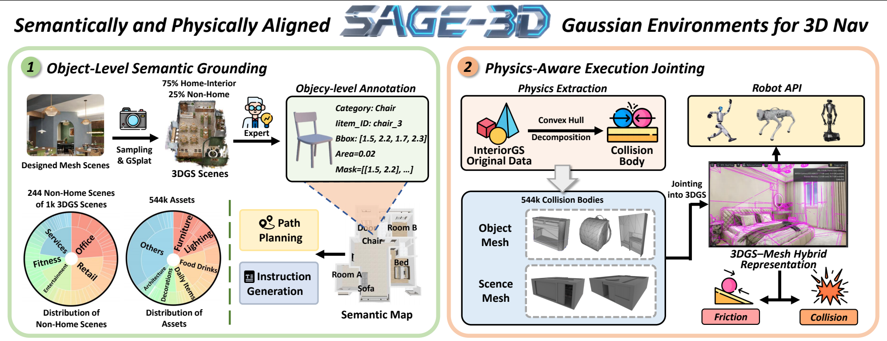

<h1 align="center" style="line-height: 40px;">
  Towards Physically Executable 3D Gaussian for Embodied Navigation
</h1>


## 💾 Introduction
Welcome to the official repository for the paper "Towards Physically Executable 3D Gaussian for Embodied Navigation". In this work, we introduce SAGE-3D, a new paradigm that upgrades 3D Gaussian Splatting (3DGS) into an executable, semantically and physically aligned environment foundation for Vision-and-Language Navigation (VLN). While current VLN research primarily follows a sim-to-real paradigm and leverages 3DGS for photorealistic rendering, existing methods lack fine-grained semantics and physical executability. SAGE-3D addresses these limitations with two key components:
1. **Object-Level Semantic Grounding** – enhancing 3DGS with dense, fine-grained object-level annotations.
2. **Physics-Aware Execution Jointing** – embedding collision bodies into 3DGS and enabling rich physical interaction interfaces.

We also release two valuable resources to support research in this domain:

1. **InteriorGS** – a dataset of 1,000 indoor 3DGS scenes with dense object-level annotations.
2. **SAGE-Bench** – the first VLN benchmark built on 3DGS, containing 2 million trajectory–instruction pairs, a hierarchical instruction generation pipeline, and three novel navigation-continuous evaluation metrics.


 ## ⭐ Contribution

1. **InteriorGS**: A large-scale dataset of 1k fully furnished indoor 3DGS reconstructions with dense object-level annotations.
2. **SAGE-3D**: A new paradigm that augments 3DGS with semantic granularity and physical validity, making it an executable environment foundation.
3. **SAGE-Bench**: The first VLN benchmark on 3DGS, with fine-grained semantics, accurate per-object physics, and rich interfaces for robot embodiments. It contains 2M new trajectory–instruction pairs and 554K detailed collision bodies.


## 📌 Contents
- [News](#new)
- [Overview](#overview)
- [SAGE-3D Scene Data Preparation](#-sage-3d-scene-data-preparation)
- [VLN Data Construction Pipeline](#-vln-data-construction-pipeline)
- [SAGE-Bench Evaluation](#-sage-bench-evaluation)
- [Experiment Results](#experiment)
- [Citation](#citation)


<a id="new"></a>

## 🔥 News
- [2025.11.28] We have released the Benchmark Environment and Dataset.
- [2025.10.24] We have released our [Paper](https://arxiv.org/abs/2510.21307) on arxiv.


<a id="Overview"></a>

## 💡 Overview

Current Vision-Language Navigation (VLN) follows the sim-to-real paradigm, where agents first learn navigation policies in simulation and then transfer them to the real world. 3D Gaussian Splatting (3DGS), a 3D representation method with photorealistic real-time rendering capability, has been regarded as a promising tool for narrowing the sim-to-real gap, yet it still lacks the fine-grained semantics and physical executability required for embodied navigation. To address this, we propose **SAGE-3D** (**S**emantical and Physical-**A**ligned **G**aussian **E**nvironments for **3D** Navigation), a new paradigm that upgrades 3DGS into an executable, semantically and physically aligned environment foundation SAGE-3D comprises two key components: **1) Object-Level Semantic Grounding**, which augments 3DGS with fine-grained, object-level annotations; and **2) Physics-Aware Execution Jointing**, which embeds collision bodies into 3DGS and provides rich physical interaction interfaces.



1. **Task Types**: 
**VLN**: Takes text and assets as input, provides a concrete goal, and evaluates whether the agent correctly reaches the target location.
**Nogoal-Nav**: Has no explicit target; the objective is to maximize environmental exploration to assess the agent’s understanding of the environment and the safety of its exploration policy. The test set consists of 100 scenes.
2. **Instruction Level**: This axis measures the semantic and structural complexity of instructions. We define two tiers of instructions. **High‑level instructions** emphasize task semantics and human‑oriented intent, and comprise six categories: *Add Causality* (introducing causal objects or actions that make a trajectory contextually meaningful); *Scenario Driven* (embedding specific situational motives that make the destination a reasonable place for execution); *Relative Relationship* (distinguishing similar nearby targets via spatial relations such as “next to” or “opposite”); *Attribute‑based* (identifying a unique target using perceivable attributes like color, state, or contents); *Area‑based* (directing the agent toward a general functional area rather than a specific object). **Low‑level instructions** focus on control and kinematic evaluation, including primitive actions such as in‑place rotations or forward moves, and single‑goal navigation where the agent reaches a specific room, object, or area in one step.  
2. **Scene Complexity**: Defined by asset density—scenes with more than 376 assets are labeled “many,” and those with fewer than 184 assets are labeled “few.”
3. **Path Complexity**: Defined by path length—paths longer than 29.0 m are labeled “long,” and those shorter than 8.4 m are labeled “short.”


<a id="Setups_for_Similar"></a>

## 🏗️ SAGE-3D Scene Data Preparation

Before constructing VLN data, you need to prepare the SAGE-3D scene data by converting InteriorGS 3D Gaussian Splatting scenes into USD format compatible with Isaac Sim. This section describes the complete pipeline from compressed PLY files to USDA scene files.

### Pipeline Overview

```
InteriorGS Compressed PLY → Original PLY → USDZ → USDA (with collision bodies)
```

### Prerequisites

Install the required external tools:

```bash
# 1. Install splat-transform for PLY decompression
# Repository: https://github.com/playcanvas/splat-transform
npm install -g @playcanvas/splat-transform

# 2. Install 3DGRUT for PLY to USDZ conversion
# Repository: https://github.com/nv-tlabs/3dgrut
git clone https://github.com/nv-tlabs/3dgrut.git
cd 3dgrut
pip install -e .
```

---

### Step 1: Download InteriorGS Data

Download InteriorGS compressed PLY files from HuggingFace:

**InteriorGS Dataset:** https://huggingface.co/datasets/spatialverse/InteriorGS

Each scene contains a compressed 3D Gaussian Splatting file:
```
InteriorGS/
├── 0001_839920/
│   └── 3dgs_compressed.ply
├── 0002_839921/
│   └── 3dgs_compressed.ply
└── ...
```

### Step 2: Convert Compressed PLY to Original PLY

Use the `splat-transform` tool to decompress the PLY files:

```bash
# Convert a single scene
splat-transform /path/to/InteriorGS/0001_839920/3dgs_compressed.ply \
    /path/to/output/0001_839920.ply

# Batch convert all scenes (example script)
for scene_dir in /path/to/InteriorGS/*/; do
    scene_id=$(basename "$scene_dir")
    splat-transform "$scene_dir/3dgs_compressed.ply" \
        "/path/to/output/${scene_id}.ply"
done
```

**Tool:** [playcanvas/splat-transform](https://github.com/playcanvas/splat-transform)

**Output:** Decompressed PLY files with full 3D Gaussian data

### Step 3: Convert PLY to USDZ

Use the `ply_to_usd.py` script from 3DGRUT to convert PLY files to USDZ format:

```bash
# Convert a single scene
python -m threedgrut.export.scripts.ply_to_usd \
    /path/to/ply/0001_839920.ply \
    --output_file /path/to/usdz/0001_839920.usdz

# Batch convert all scenes (example script)
for ply_file in /path/to/ply/*.ply; do
    scene_id=$(basename "$ply_file" .ply)
    python -m threedgrut.export.scripts.ply_to_usd \
        "$ply_file" \
        --output_file "/path/to/usdz/${scene_id}.usdz"
done
```

**Tool:** [nv-tlabs/3dgrut](https://github.com/nv-tlabs/3dgrut)

**Parameters:**
- Input: Original PLY file
- `--output_file`: Output USDZ file path

**Output:** USDZ files compatible with Omniverse and Isaac Sim 5.0+

**Note:** The USDZ format uses an extension of the UsdVolVolume Schema specifically designed for 3D Gaussian rendering in Isaac Sim.

### Step 4: Download Collision Mesh Data

Download pre-built collision meshes for each scene:

**SAGE-3D Collision Mesh Dataset:** https://huggingface.co/datasets/spatialverse/SAGE-3D_Collision_Mesh

The collision meshes are organized by scene ID:
```
SAGE-3D_Collision_Mesh/
├── 0001_839920/
│   └── 0001_839920_collision.usd
├── 0002_839921/
│   └── 0002_839921_collision.usd
└── ...
```

These collision meshes enable accurate physics simulation and collision detection during navigation.

### Step 5: Build USDA Scene Files

Convert USDZ files to USDA format and integrate collision bodies using our builder script:

```bash
python Code/benchmark/scene_data/sage3d_usda_builder.py \
    --usdz-dir /path/to/usdz \
    --out-dir /path/to/output/usda \
    --template Data/template.usda \
    --usdz-placeholder "@usdz_root[gauss.usda]@" \
    --collision-placeholder "@collision_root@" \
    --usdz-path-template "/path/to/usdz/{scene_id}.usdz[gauss.usda]" \
    --collision-path-template "/path/to/collision/{scene_id}/{scene_id}_collision.usd" \
    --overwrite
```

**Parameters:**
- `--usdz-dir`: Directory containing USDZ scene files
- `--out-dir`: Output directory for USDA files
- `--template`: Path to USDA template file
- `--usdz-placeholder`: Placeholder string in template for USDZ reference (default: `@usdz_root[gauss.usda]@`)
- `--collision-placeholder`: Placeholder string in template for collision payload (default: `@collision_root@`)
- `--usdz-path-template`: Template for USDZ reference path (use `{scene_id}` as placeholder)
- `--collision-path-template`: Template for collision payload path (use `{scene_id}` as placeholder)
- `--overwrite`: Overwrite existing USDA files
- `--limit`: (Optional) Limit number of files to generate (for testing)

**Output:**
- `{scene_id}.usda`: Complete scene files ready for Isaac Sim with integrated collision bodies

---

### Complete Scene Preparation Example

Here's a complete example for preparing SAGE-3D scenes:

```bash
# ============================================================
# Step 1: Download InteriorGS Data
# ============================================================
# Download from https://huggingface.co/datasets/spatialverse/InteriorGS
# Extract to /path/to/InteriorGS

# ============================================================
# Step 2: Decompress PLY Files
# ============================================================
mkdir -p /path/to/ply_decompressed

for scene_dir in /path/to/InteriorGS/*/; do
    scene_id=$(basename "$scene_dir")
    echo "Processing ${scene_id}..."
    splat-transform \
        "$scene_dir/3dgs_compressed.ply" \
        "/path/to/ply_decompressed/${scene_id}.ply"
done

# ============================================================
# Step 3: Convert to USDZ
# ============================================================
mkdir -p /path/to/usdz_output

for ply_file in /path/to/ply_decompressed/*.ply; do
    scene_id=$(basename "$ply_file" .ply)
    echo "Converting ${scene_id} to USDZ..."
    python -m threedgrut.export.scripts.ply_to_usd \
        "$ply_file" \
        --output_file "/path/to/usdz_output/${scene_id}.usdz"
done

# ============================================================
# Step 4: Download Collision Meshes
# ============================================================
# Download from https://huggingface.co/datasets/spatialverse/SAGE-3D_Collision_Mesh
# Extract to /path/to/collision_meshes

# ============================================================
# Step 5: Build USDA Files
# ============================================================
python Code/benchmark/scene_data/sage3d_usda_builder.py \
    --usdz-dir /path/to/usdz_output \
    --out-dir /path/to/usda_output \
    --template Data/template.usda \
    --usdz-path-template "/path/to/usdz_output/{scene_id}.usdz[gauss.usda]" \
    --collision-path-template "/path/to/collision_meshes/{scene_id}/{scene_id}_collision.usd" \
    --overwrite

echo "Scene preparation complete! USDA files are ready at /path/to/usda_output"
```

**Note:** The prepared USDA files will be used in both VLN data construction (for rendering training images) and benchmark evaluation (for testing navigation models).

---

## 🔧 VLN Data Construction Pipeline

This section describes the complete pipeline for constructing VLN training and testing data from InteriorGS 3D Gaussian Splatting scenes. The pipeline transforms 3DGS scenes into a complete VLN dataset with trajectories, natural language instructions, and training data (RGB images + action sequences).

**Prerequisites:** Complete the [SAGE-3D Scene Data Preparation](#-sage-3d-scene-data-preparation) first to generate USDA scene files.

### Environment Setup

Install the required dependencies:

```bash
pip install -r requirements.txt
```

### Stage 1: Scene Preprocessing

#### 1.1 InteriorGS → 2D Semantic Map

Convert InteriorGS 3D scenes into 2D semantic maps for navigation planning:

```bash
cd /path/to/SAGE-3D

python Code/data_pipeline/interiorgs_processing/semantic_map_builder.py \
    --input-root /path/to/InteriorGS \
    --output-root /path/to/output/semantic_maps \
    --max-scenes 5 \
    --overwrite
```

**Parameters:**
- `--input-root`: Directory containing InteriorGS scene folders (each with `labels.json`, `occupancy.json`, `occupancy.png`)
- `--output-root`: Output directory for generated 2D semantic maps
- `--max-scenes`: (Optional) Limit the number of scenes to process for testing
- `--overwrite`: Overwrite existing semantic map files

**Output:**
- `2D_Semantic_Map_{scene_id}_Complete.json`: Semantic map with object labels and positions
- `2D_Semantic_Map_{scene_id}_Complete.png`: Visualization of the semantic map

#### 1.2 InteriorGS → 2D Scene Text Map

Convert InteriorGS scenes into textual scene descriptions for instruction generation:

**Step 1: Convert to Physical Map**

```bash
python Code/data_pipeline/interiorgs_processing/physical_map_converter.py \
    --src-root /path/to/InteriorGS \
    --dst-root /path/to/output/physical_maps \
    --overwrite
```

**Parameters:**
- `--src-root`: InteriorGS dataset root directory
- `--dst-root`: Output directory for physical maps
- `--overwrite`: Overwrite existing files

**Output:**
- `{scene_id}/scene.json`: Bounding box coordinates for each object in the scene

**Step 2: Convert Physical Map to Scene Text**

```bash
python Code/data_pipeline/interiorgs_processing/scene_text_generator.py \
    --physical-map-root /path/to/physical_maps \
    --output-root /path/to/output/scene_text \
    --prompt-file prompts/prompt_phy_to_sem.json \
    --api-base https://api.openai.com/v1 \
    --model gpt-4o-mini \
    --api-key $OPENAI_API_KEY
```

**Parameters:**
- `--physical-map-root`: Directory containing physical map files
- `--output-root`: Output directory for scene text descriptions
- `--prompt-file`: JSON file containing prompt template
- `--api-base`: OpenAI API endpoint URL
- `--model`: LLM model name
- `--api-key`: OpenAI API key (or use environment variable `$OPENAI_API_KEY`)
- `--workers`: (Optional) Number of parallel workers (default: 8)
- `--temperature`: (Optional) LLM sampling temperature (default: 0.7)

**Output:**
- `{scene_id}_semantic.txt`: Natural language description of scene layout and objects

---

### Stage 2: VLN Trajectory Generation

#### 2.1 Generate 2D Trajectories with Instructions

Generate navigation trajectories on 2D semantic maps with natural language instructions:

```bash
python Code/data_pipeline/trajectory_generation/vln_trajectory_generator.py \
    --api-type openai \
    --api-key YOUR_OPENAI_API_KEY \
    --api-base https://api.openai.com/v1 \
    --model gpt-4o-mini \
    --min-trajs 100 \
    --label-root /path/to/InteriorGS \
    --scene-text-root /path/to/scene_text \
    --sem-map-root /path/to/semantic_maps \
    --endpoint-root /path/to/output/endpoints \
    --traj-root /path/to/output/trajectories \
    --prompt-pairwise prompts/trajectory_generation/prompt_pairwise_judgement.json \
    --prompt-pairwise-batch prompts/trajectory_generation/prompt_pairwise_judgement_v2.json \
    --prompt-traj-to-instr prompts/trajectory_generation/prompt_traj_to_instruction_v2.json
```

**Parameters:**
- `--api-type`: API client type (`openai` or `company`)
- `--api-key`: API key for LLM service
- `--api-base`: API endpoint URL
- `--model`: LLM model name
- `--min-trajs`: Minimum trajectories to generate per scene
- `--label-root`: InteriorGS dataset root (for scene metadata)
- `--scene-text-root`: Directory containing scene text descriptions
- `--sem-map-root`: Directory containing 2D semantic maps
- `--endpoint-root`: Output directory for endpoint samples
- `--traj-root`: Output directory for trajectory data
- `--prompt-pairwise`: Path to pairwise judgment prompt JSON
- `--prompt-pairwise-batch`: Path to batch pairwise judgment prompt JSON
- `--prompt-traj-to-instr`: Path to trajectory-to-instruction prompt JSON
- `--only`: (Optional) Process only specific scene ID (e.g., `0001_839920`)
- `--judge-workers`: (Optional) Number of parallel workers for reachability judgment (default: 32)
- `--instr-workers`: (Optional) Number of parallel workers for instruction generation (default: 32)

**Output:**
- `endpoints_{scene_id}.json`: Sampled start/end point pairs
- `trajectories_{scene_id}.json`: Navigation trajectories with 2D coordinates and instructions

#### 2.2 Convert 2D Trajectories to 3D Space

Transform 2D trajectory coordinates to 3D world coordinates:

```bash
python Code/data_pipeline/trajectory_generation/trajectory_2d_to_3d.py \
    --traj-root /path/to/trajectories \
    --map-root /path/to/semantic_maps
```

**Parameters:**
- `--traj-root`: Directory containing 2D trajectory files
- `--map-root`: Directory containing semantic map metadata (with coordinate bounds)
- `--flip-x`: (Optional) Apply horizontal mirroring (default: True)
- `--flip-y`: (Optional) Apply vertical mirroring (default: True)
- `--negate-xy`: (Optional) Negate coordinates after flipping (default: True)

**Output:**
- Trajectory files updated with 3D coordinates in-place

#### 2.3 Merge Part-wise Trajectory Data

If trajectories were generated in multiple parts, merge them:

```bash
python Code/data_pipeline/trajectory_generation/trajectory_merge.py \
    --source-dir /path/to/trajectories \
    --output-dir /path/to/trajectories_merged
```

**Parameters:**
- `--source-dir`: Directory containing part-wise trajectory files
- `--output-dir`: Output directory for merged trajectories
- `--overwrite`: (Optional) Overwrite existing merged files

**Output:**
- `{scene_id}/trajectories_overall_merged.json`: Merged trajectory data per scene

#### 2.4 Compute Trajectory Statistics

Analyze trajectory data and generate statistics:

```bash
python Code/data_pipeline/trajectory_generation/trajectory_statistics.py \
    --data-dir /path/to/trajectories_merged
```

**Parameters:**
- `--data-dir`: Directory containing merged trajectory data

**Output:**
- Console output with statistics on trajectory lengths, scene coverage, instruction types, etc.

---

### Stage 3: Dataset Splitting and Training Data Construction

#### 3.1 Split Data into Train/Val/Test Sets

**Step 1: Generate Domain-Aware Split Mapping**

Create split mappings with domain awareness (scene type, trajectory complexity):

```bash
python Code/data_pipeline/data_split/trajectory_split_domain_aware.py \
    --traj-root /path/to/trajectories_merged \
    --scene-type-file Data/scene_type.json \
    --output-dir /path/to/output/split_mappings
```

**Parameters:**
- `--traj-root`: Directory containing merged trajectories
- `--scene-type-file`: JSON file mapping scene IDs to scene types
- `--output-dir`: Output directory for split mapping files
- `--target-scenes-per-test`: (Optional) Target number of scenes per test split (default: 15)
- `--target-pairs-per-test`: (Optional) Target number of trajectory pairs per test split (default: 1000)
- `--val-scenes`: (Optional) Number of validation scenes (default: 20)
- `--val-pairs`: (Optional) Number of validation trajectory pairs (default: 50000)
- `--random-seed`: (Optional) Random seed for reproducibility (default: 42)

**Output:**
- `GSNav-Bench_Train_Split_Domain.json`: Training set mapping
- `GSNav-Bench_Val_Split_Domain.json`: Validation set mapping
- `GSNav-Bench_Test_Scene_Unseen_Split_Domain.json`: Scene-unseen test mapping
- `GSNav-Bench_Test_Trajectory_Unseen_Split_Domain.json`: Trajectory-unseen test mapping
- `GSNav-Bench_Test_Instruction_Unseen_Split_Domain.json`: Instruction-unseen test mapping

**Step 2: Extract Split Data Based on Mapping**

```bash
python Code/data_pipeline/data_split/benchmark_data_splitter.py \
    --original-data-dir /path/to/trajectories_merged \
    --mapping-dir /path/to/split_mappings \
    --train-dir /path/to/output/train \
    --val-dir /path/to/output/val \
    --scene-unseen-dir /path/to/output/test_scene_unseen \
    --trajectory-unseen-dir /path/to/output/test_trajectory_unseen \
    --instruction-unseen-dir /path/to/output/test_instruction_unseen
```

**Parameters:**
- `--original-data-dir`: Directory containing original merged trajectories
- `--mapping-dir`: Directory containing split mapping JSON files (from Step 1)
- `--train-dir`: Output directory for training set
- `--val-dir`: Output directory for validation set
- `--scene-unseen-dir`: Output directory for scene-unseen test set
- `--trajectory-unseen-dir`: Output directory for trajectory-unseen test set
- `--instruction-unseen-dir`: Output directory for instruction-unseen test set
- `--rename-files`: (Optional) Add split-specific prefixes to output filenames

**Output:**
- Training, validation, and test set trajectories organized by split type

#### 3.2 Generate Training Data (Action Groundtruth)

Generate action sequences from trajectories:

```bash
python Code/data_pipeline/training_data_construction/generate_actions.py \
    --input-dir /path/to/train/trajectories \
    --output-dir /path/to/output/actions \
    --limit 5
```

**Parameters:**
- `--input-dir`: Directory containing training trajectory files
- `--output-dir`: Output directory for action groundtruth
- `--config-preset`: (Optional) Action configuration preset (`vlnce`, `navila_small`, `navila_large`, `custom_small`, default: `vlnce`)
- `--max-workers`: (Optional) Number of parallel workers (default: CPU count)
- `--limit`: (Optional) Limit number of trajectories to process (useful for testing)

**Configuration Presets:**
- `navila_small`: 0.35m forward, 30° turn, max 50 actions
- `vlnce`: 0.25m forward, 15° turn, max 50 actions
- `navila_large`: 0.75m forward, 15° turn, max 30 actions
- `custom_small`: 0.50m forward, 30° turn, max 60 actions

**Output:**
- `{scene_id}/{trajectory_id}_action.json`: Action sequences with sampled waypoints

#### 3.3 Generate Training Data (RGB Images)

Render RGB images at trajectory waypoints using Isaac Sim. This step requires Isaac Sim to be installed.

**Important:** Use Isaac Sim's Python interpreter to run this script:

```bash
# Single instance
/path/to/isaac-sim/python.sh \
    Code/data_pipeline/training_data_construction/generate_images.py \
    --input-dir /path/to/train/trajectories \
    --usd-root /path/to/InteriorGS_usda \
    --output-dir /path/to/output/images \
    --action-root /path/to/actions \
    --max-trajectories 50

# For distributed processing (4 instances example):
# Instance 0
/path/to/isaac-sim/python.sh \
    Code/data_pipeline/training_data_construction/generate_images.py \
    --input-dir /path/to/train/trajectories \
    --usd-root /path/to/InteriorGS_usda \
    --output-dir /path/to/output/images \
    --action-root /path/to/actions \
    --max-trajectories 50 \
    --instance-id 0 \
    --total-instances 4

# Instance 1
/path/to/isaac-sim/python.sh ... --instance-id 1 --total-instances 4

# Instance 2
/path/to/isaac-sim/python.sh ... --instance-id 2 --total-instances 4

# Instance 3
/path/to/isaac-sim/python.sh ... --instance-id 3 --total-instances 4
```

**Parameters:**
- `--input-dir`: Directory containing training trajectories
- `--usd-root`: Directory containing USD/USDA scene files
- `--output-dir`: Output directory for rendered images
- `--action-root`: Directory containing action groundtruth (for waypoint synchronization)
- `--max-trajectories`: (Optional) Limit trajectories per scene
- `--force`: (Optional) Force reprocess even if already processed
- `--instance-id`: (Optional) Instance ID for distributed processing (0-indexed)
- `--total-instances`: (Optional) Total number of instances for distributed processing

**Notes:**
- Camera resolution: 1024×768
- Camera height: 1.2m
- FOV determined by focal length (8.0mm)
- Image generation requires significant GPU resources; distributed processing is recommended

**Output:**
- `{scene_id}/{trajectory_id}/frames/`: RGB images at each waypoint
- `{scene_id}/{trajectory_id}/metadata.json`: Image metadata and camera parameters

#### 3.4 Create NaVILA Training Dataset

Convert action and image data into NaVILA training format:

```bash
python Code/data_pipeline/training_data_construction/create_navila_dataset.py \
    --actions-dir /path/to/actions \
    --images-dir /path/to/images \
    --output-dir /path/to/output/navila_dataset \
    --max-scenes 5 \
    --samples-per-part 1000
```

**Parameters:**
- `--actions-dir`: Directory containing action groundtruth
- `--images-dir`: Directory containing rendered images
- `--output-dir`: Output directory for NaVILA format dataset
- `--max-scenes`: (Optional) Limit number of scenes to process (for testing)
- `--samples-per-part`: (Optional) Number of samples per output file (default: 10000)

**Output:**
- `navila_train_part_{N}.json`: Training data in NaVILA format (one file per part)
- `navila_train_statistics.json`: Dataset statistics (sample counts, action distribution, etc.)

---

### Complete Pipeline Example

Here's a complete example running the full data construction pipeline:

```bash
# ============================================================
# Stage 1: Scene Preprocessing
# ============================================================

# 1.1 Generate 2D Semantic Maps
cd /path/to/SAGE-3D
python Code/data_pipeline/interiorgs_processing/semantic_map_builder.py \
    --input-root /path/to/InteriorGS \
    --output-root /path/to/semantic_maps \
    --max-scenes 5 \
    --overwrite

# 1.2 Generate Physical Maps
python Code/data_pipeline/interiorgs_processing/physical_map_converter.py \
    --src-root /path/to/InteriorGS \
    --dst-root /path/to/physical_maps \
    --overwrite

# 1.3 Generate Scene Text Descriptions
python Code/data_pipeline/interiorgs_processing/scene_text_generator.py \
    --physical-map-root /path/to/physical_maps \
    --output-root /path/to/scene_text \
    --prompt-file prompts/prompt_phy_to_sem.json \
    --api-base https://api.openai.com/v1 \
    --model gpt-4o-mini \
    --api-key $OPENAI_API_KEY

# ============================================================
# Stage 2: VLN Trajectory Generation
# ============================================================

# 2.1 Generate 2D Trajectories with Instructions
python Code/data_pipeline/trajectory_generation/vln_trajectory_generator.py \
    --api-type openai \
    --api-key $OPENAI_API_KEY \
    --api-base https://api.openai.com/v1 \
    --model gpt-4o-mini \
    --min-trajs 100 \
    --label-root /path/to/InteriorGS \
    --scene-text-root /path/to/scene_text \
    --sem-map-root /path/to/semantic_maps \
    --endpoint-root /path/to/endpoints \
    --traj-root /path/to/trajectories \
    --prompt-pairwise prompts/trajectory_generation/prompt_pairwise_judgement.json \
    --prompt-pairwise-batch prompts/trajectory_generation/prompt_pairwise_judgement_v2.json \
    --prompt-traj-to-instr prompts/trajectory_generation/prompt_traj_to_instruction_v2.json

# 2.2 Convert 2D to 3D Coordinates
python Code/data_pipeline/trajectory_generation/trajectory_2d_to_3d.py \
    --traj-root /path/to/trajectories \
    --map-root /path/to/semantic_maps

# 2.3 Merge Part-wise Trajectories
python Code/data_pipeline/trajectory_generation/trajectory_merge.py \
    --source-dir /path/to/trajectories \
    --output-dir /path/to/trajectories_merged

# 2.4 Compute Statistics (Optional)
python Code/data_pipeline/trajectory_generation/trajectory_statistics.py \
    --data-dir /path/to/trajectories_merged

# ============================================================
# Stage 3: Dataset Splitting and Training Data Construction
# ============================================================

# 3.1 Generate Domain-Aware Split Mapping
python Code/data_pipeline/data_split/trajectory_split_domain_aware.py \
    --traj-root /path/to/trajectories_merged \
    --scene-type-file Data/scene_type.json \
    --output-dir /path/to/split_mappings

# 3.2 Extract Split Data
python Code/data_pipeline/data_split/benchmark_data_splitter.py \
    --original-data-dir /path/to/trajectories_merged \
    --mapping-dir /path/to/split_mappings \
    --train-dir /path/to/train \
    --val-dir /path/to/val \
    --scene-unseen-dir /path/to/test_scene_unseen \
    --trajectory-unseen-dir /path/to/test_trajectory_unseen \
    --instruction-unseen-dir /path/to/test_instruction_unseen

# 3.3 Generate Action Groundtruth
python Code/data_pipeline/training_data_construction/generate_actions.py \
    --input-dir /path/to/train \
    --output-dir /path/to/actions \
    --limit 5

# 3.4 Render RGB Images (requires Isaac Sim)
/path/to/isaac-sim/python.sh \
    Code/data_pipeline/training_data_construction/generate_images.py \
    --input-dir /path/to/train \
    --usd-root /path/to/InteriorGS_usda \
    --output-dir /path/to/images \
    --action-root /path/to/actions \
    --max-trajectories 50

# 3.5 Create NaVILA Training Dataset
python Code/data_pipeline/training_data_construction/create_navila_dataset.py \
    --actions-dir /path/to/actions \
    --images-dir /path/to/images \
    --output-dir /path/to/navila_dataset \
    --max-scenes 5 \
    --samples-per-part 1000
```

**Notes:**
- Replace `/path/to/...` with your actual data paths
- Set `$OPENAI_API_KEY` environment variable for LLM-based generation
- For distributed image generation, run multiple instances with different `--instance-id`
- Adjust `--max-scenes`, `--limit`, and `--max-trajectories` based on your testing needs

---

---

## 🎯 SAGE-Bench Evaluation

This section describes how to set up the SAGE-Bench evaluation environment and run benchmark tests on VLN models including NaVILA and various MLLMs.

**Prerequisites:** Complete the [SAGE-3D Scene Data Preparation](#-sage-3d-scene-data-preparation) to generate USDA scene files before running benchmark tests.

### Environment Setup

**Requirements:**
- Isaac Sim (for physics simulation and rendering) - Version 4.1+ recommended
- NVIDIA GPU with at least 16GB VRAM (24GB+ recommended for MLLMs)
- Python 3.8+
- CUDA-enabled PyTorch
- Prepared USDA scene files (from Scene Data Preparation step)

**Installation:**

```bash
# Install Isaac Sim (follow official NVIDIA Isaac Sim installation guide)
# Download from: https://developer.nvidia.com/isaac-sim

# Install benchmark dependencies
pip install -r requirements.txt
```

---

### Stage 1: Model Server Setup

SAGE-Bench supports multiple VLN models through a server-client architecture. You need to start a model server before running the benchmark.

#### 2.1 NaVILA Model Server

**Activate Environment and Start Server:**

```bash
# Activate NaVILA environment
conda activate navila-eval

# Start NaVILA server
cd /path/to/NaVILA
python scripts/vlm_server_multigpu.py \
    --model_path /path/to/navila-model \
    --port 54321 \
    --device cuda
```

**Parameters:**
- `--model_path`: Path to NaVILA model checkpoint
- `--port`: Port number for server (default: 54321)
- `--device`: Device to use (`cuda` or `cpu`)

**Supported NaVILA Models:**
- `navila-llama3-8b-8f`: NaVILA with LLaMA3-8B backbone, 8 frames
- `navila-llama3-8b-4f`: NaVILA with LLaMA3-8B backbone, 4 frames
- Other NaVILA variants trained on SAGE-Bench data

#### 2.2 MLLM Model Server

Start an MLLM server for general vision-language models:

```bash
# Activate MLLM environment
conda activate mllm

# Start Qwen2.5-VL server (example)
python Code/benchmark/environment_evaluation/evaluation_model/MLLM/mllm_server.py \
    --model_type qwen-vl \
    --model_path /path/to/Qwen2.5-VL-7B-Instruct \
    --port 7777 \
    --device cuda

# Start LLaVA server (example)
python Code/benchmark/environment_evaluation/evaluation_model/MLLM/mllm_server.py \
    --model_type llava \
    --model_path /path/to/llava-1.5-7b-hf \
    --port 7778 \
    --device cuda

# Start InternVL server (example)
python Code/benchmark/environment_evaluation/evaluation_model/MLLM/mllm_server.py \
    --model_type internvl \
    --model_path /path/to/InternVL2-8B \
    --port 7779 \
    --device cuda
```

**Parameters:**
- `--model_type`: Model type (`qwen-vl`, `llava`, `internvl`)
- `--model_path`: Path to model checkpoint or HuggingFace model ID
- `--port`: Port number for server
- `--host`: (Optional) Host address (default: `localhost`)
- `--device`: Device to use (`cuda` or `cpu`)

**Supported MLLM Models:**
- **Qwen2.5-VL**: Alibaba's vision-language model (e.g., `Qwen/Qwen2.5-VL-7B-Instruct`)
- **LLaVA**: Open-source VLM (e.g., `llava-hf/llava-1.5-7b-hf`)
- **InternVL**: OpenGVLab's vision-language model (e.g., `OpenGVLab/InternVL2-8B`)
- **Custom Models**: Easily add new models by creating adapter classes

---

### Stage 2: Run Benchmark Tests

SAGE-Bench supports three types of navigation tasks:

#### 3.1 Standard VLN Test

Test models on high-level vision-language navigation with instruction following:

```bash
# Use Isaac Sim's Python interpreter
/path/to/isaac-sim/python.sh \
    Code/benchmark/environment_evaluation/run_benchmark.py \
    --scene_usd_path /path/to/InteriorGS_usda \
    --batch_test_dir /path/to/test_data/vln \
    --map_path /path/to/semantic_maps \
    --output_root /path/to/output/results \
    --task-type vln \
    --input-type rgb \
    --protocol socket \
    --vlm-port 54321
```

**Test Splits:**
- **Scene-Unseen**: Test on unseen scene types
- **Trajectory-Unseen**: Test on unseen trajectory patterns in seen scenes
- **Instruction-Unseen**: Test on unseen instruction phrasings for seen trajectories

#### 3.2 Low-Level VLN Test

Test models on low-level control and kinematic evaluation:

```bash
/path/to/isaac-sim/python.sh \
    Code/benchmark/environment_evaluation/run_benchmark.py \
    --scene_usd_path /path/to/InteriorGS_usda \
    --batch_test_dir /path/to/test_data/low_level \
    --map_path /path/to/semantic_maps \
    --output_root /path/to/output/results_low_level \
    --task-type vln \
    --input-type rgb \
    --protocol socket \
    --vlm-port 54321
```

**Low-Level Instructions Include:**
- Primitive actions (turn left/right, move forward)
- Single-step navigation goals
- Simple spatial references

#### 3.3 No-Goal Navigation Test

Test exploration and collision avoidance without explicit goals:

```bash
/path/to/isaac-sim/python.sh \
    Code/benchmark/environment_evaluation/run_benchmark.py \
    --scene_usd_path /path/to/InteriorGS_usda \
    --batch_test_dir /path/to/test_data/no_goal \
    --map_path /path/to/semantic_maps \
    --output_root /path/to/output/results_nogoal \
    --task-type nogoalnav \
    --input-type rgb \
    --protocol socket \
    --vlm-port 54321
```

**No-Goal Metrics:**
- Collision Rate (CR)
- Exploration Coverage
- Navigation Safety

---

### Benchmark Parameters

**Common Parameters:**
- `--scene_usd_path`: Directory containing USDA scene files
- `--batch_test_dir`: Directory containing test trajectory data
- `--map_path`: Directory containing 2D semantic maps (for collision detection)
- `--output_root`: Output directory for results
- `--task-type`: Task type (`vln`, `objectnav`, `pointnav`, `imgnav`, `nogoalnav`)
- `--input-type`: Input modality (`rgb`, `rgbd`, `depth`)
- `--protocol`: Communication protocol (`socket` or `http`)
- `--vlm-port`: VLM server port number
- `--vlm-host`: (Optional) VLM server host (default: `localhost`)

**Optional Parameters:**
- `--instance-id`: (Optional) Instance ID for distributed testing
- `--total-instances`: (Optional) Total number of instances for distributed testing
- `--max-episodes`: (Optional) Maximum episodes to test (for quick testing)
- `--headless`: (Optional) Run in headless mode (default: True)
- `--silent-logging`: (Optional) Enable silent logging mode

**Output Files:**
- `{scene_id}/{episode_id}/measurements/{episode_id}.json`: Episode metrics
- `{scene_id}/{episode_id}/trajectory_visualization_{scene_id}_{episode_id}.png`: Trajectory visualization
- `aggregate_results.json`: Aggregated metrics across all episodes

---

### Evaluation Metrics

SAGE-Bench provides comprehensive evaluation metrics:

**Navigation Success Metrics:**
- **Success Rate (SR)**: Percentage of episodes reaching the goal
- **Success weighted by Path Length (SPL)**: SR weighted by path efficiency
- **Oracle Success Rate (OSR)**: Success if agent gets close to goal at any point

**Navigation Quality Metrics:**
- **Navigation Error (NE)**: Final distance to goal
- **Path Length (PL)**: Total distance traveled
- **Oracle Path Length (OPL)**: Path length at closest approach to goal

**Safety Metrics:**
- **Collision Rate (CR)**: Number of collisions per episode
- **Collision-Free Success Rate**: Success without collisions

**Navigation Continuity Metrics (Novel):**
- **Continuous Success Ratio (CSR)**: Measures the ratio of successful navigation steps along the trajectory
- **Integrated Collision Penalty (ICP)**: Penalizes collisions weighted by their severity and frequency
- **Path Smoothness (PS)**: Evaluates the smoothness of the navigation path

---

### Complete Testing Example

Here's a complete example for testing NaVILA on all three task types:

```bash
# ============================================================
# Prerequisites: Complete SAGE-3D Scene Data Preparation
# ============================================================
# Ensure you have prepared USDA scene files following the
# SAGE-3D Scene Data Preparation section

# ============================================================
# Step 1: Start NaVILA Server (in separate terminal)
# ============================================================
conda activate navila-eval
cd /path/to/NaVILA
python scripts/vlm_server_multigpu.py \
    --model_path /path/to/navila-model \
    --port 54321 \
    --device cuda

# ============================================================
# Step 2: Run Benchmark Tests
# ============================================================

# Standard VLN Test
/path/to/isaac-sim/python.sh \
    Code/benchmark/environment_evaluation/run_benchmark.py \
    --scene_usd_path /path/to/InteriorGS_usda \
    --batch_test_dir /path/to/test_data/vln \
    --map_path /path/to/semantic_maps \
    --output_root /path/to/results/vln \
    --task-type vln \
    --vlm-port 54321

# Low-Level VLN Test
/path/to/isaac-sim/python.sh \
    Code/benchmark/environment_evaluation/run_benchmark.py \
    --scene_usd_path /path/to/InteriorGS_usda \
    --batch_test_dir /path/to/test_data/low_level \
    --map_path /path/to/semantic_maps \
    --output_root /path/to/results/low_level \
    --task-type vln \
    --vlm-port 54321

# No-Goal Navigation Test
/path/to/isaac-sim/python.sh \
    Code/benchmark/environment_evaluation/run_benchmark.py \
    --scene_usd_path /path/to/InteriorGS_usda \
    --batch_test_dir /path/to/test_data/no_goal \
    --map_path /path/to/semantic_maps \
    --output_root /path/to/results/nogoal \
    --task-type nogoalnav \
    --vlm-port 54321
```

**Notes:**
- Start the model server in a separate terminal before running tests
- Use Isaac Sim's Python interpreter for benchmark execution
- Results will be saved in the specified output directory
- For distributed testing, run multiple instances with different `--instance-id`

<a id="Experiment"></a>


## 📦 Cition

If you find this work useful for your research, please cite our paper:

```bibtex

@misc{miao2025physicallyexecutable3dgaussian,
      title={Towards Physically Executable 3D Gaussian for Embodied Navigation}, 
      author={Bingchen Miao and Rong Wei and Zhiqi Ge and Xiaoquan sun and Shiqi Gao and Jingzhe Zhu and Renhan Wang and Siliang Tang and Jun Xiao and Rui Tang and Juncheng Li},
      year={2025},
      eprint={2510.21307},
      archivePrefix={arXiv},
      primaryClass={cs.CV},
      url={https://arxiv.org/abs/2510.21307}, 
}

```