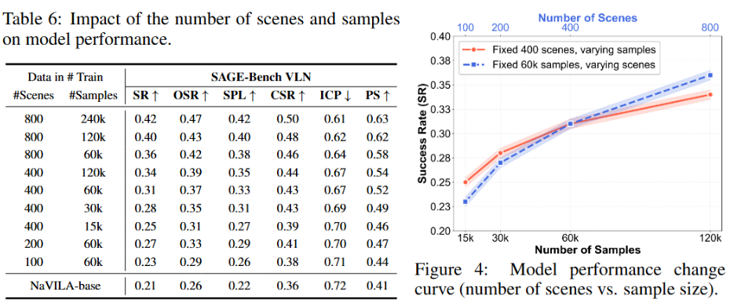
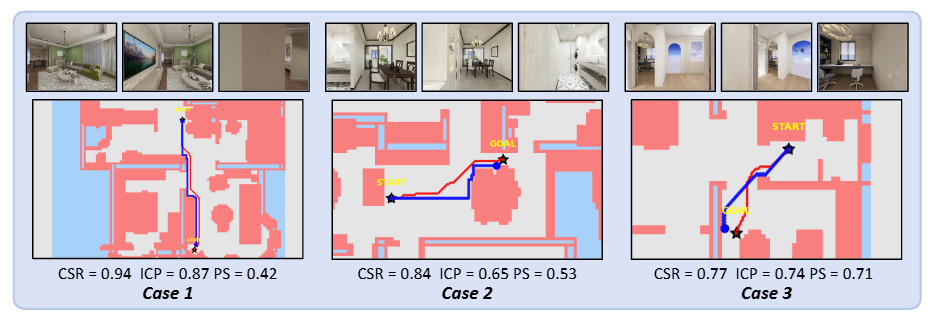
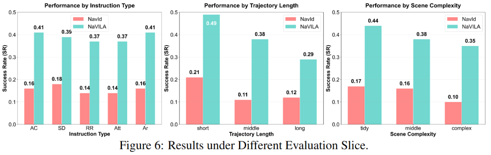

<h1 align="center" style="line-height: 40px;">
  Towards Physically Executable 3D Gaussian for Embodied Navigation
</h1>


## 💾 Introduction
Welcome to the official repository for the paper "Towards Physically Executable 3D Gaussian for Embodied Navigation". In this work, we introduce SAGE-3D, a new paradigm that upgrades 3D Gaussian Splatting (3DGS) into an executable, semantically and physically aligned environment foundation for Vision-and-Language Navigation (VLN). While current VLN research primarily follows a sim-to-real paradigm and leverages 3DGS for photorealistic rendering, existing methods lack fine-grained semantics and physical executability. SAGE-3D addresses these limitations with two key components:
1. **Object-Level Semantic Grounding** – enhancing 3DGS with dense, fine-grained object-level annotations.
2. **Physics-Aware Execution Jointing** – embedding collision bodies into 3DGS and enabling rich physical interaction interfaces.

We also release two valuable resources to support research in this domain:

1. **InteriorGS** – a dataset of 1,000 indoor 3DGS scenes with dense object-level annotations.
2. **SAGE-Bench** – the first VLN benchmark built on 3DGS, containing 2 million trajectory–instruction pairs, a hierarchical instruction generation pipeline, and three novel navigation-continuous evaluation metrics.


 ## ⭐ Contribution

1. **InteriorGS**: A large-scale dataset of 1k fully furnished indoor 3DGS reconstructions with dense object-level annotations.
2. **SAGE-3D**: A new paradigm that augments 3DGS with semantic granularity and physical validity, making it an executable environment foundation.
3. **SAGE-Bench**: The first VLN benchmark on 3DGS, with fine-grained semantics, accurate per-object physics, and rich interfaces for robot embodiments. It contains 2M new trajectory–instruction pairs and 554K detailed collision bodies.


## 📌 Contents
- [New](#new)
- [Framework](#overview)
- [Introduction](#Introduction)
- [Setups for Similar](#Setups_for_Similar)
- [Experiment](#Experiment)
- [Conclusion](#Conclusion)


<a id="new"></a>

## 🔥 News
- **[Coming Soon]** We will release the Benchmark Environment, Dataset soon.


<a id="Overview"></a>

## 💡 Overview

Current Vision-Language Navigation (VLN) follows the sim-to-real paradigm, where agents first learn navigation policies in simulation and then transfer them to the real world. 3D Gaussian Splatting (3DGS), a 3D representation method with photorealistic real-time rendering capability, has been regarded as a promising tool for narrowing the sim-to-real gap, yet it still lacks the fine-grained semantics and physical executability required for embodied navigation. To address this, we propose **SAGE-3D** (**S**emantical and Physical-**A**ligned **G**aussian **E**nvironments for **3D** Navigation), a new paradigm that upgrades 3DGS into an executable, semantically and physically aligned environment foundation SAGE-3D comprises two key components: **1) Object-Level Semantic Grounding**, which augments 3DGS with fine-grained, object-level annotations; and **2) Physics-Aware Execution Jointing**, which embeds collision bodies into 3DGS and provides rich physical interaction interfaces.


1. **Task Types**: 
**VLN**: Takes text and assets as input, provides a concrete goal, and evaluates whether the agent correctly reaches the target location.
**Nogoal-Nav**: Has no explicit target; the objective is to maximize environmental exploration to assess the agent’s understanding of the environment and the safety of its exploration policy. The test set consists of 100 scenes.
2. **Instruction Level**: This axis measures the semantic and structural complexity of instructions. We define two tiers of instructions. **High‑level instructions** emphasize task semantics and human‑oriented intent, and comprise six categories: *Add Causality* (introducing causal objects or actions that make a trajectory contextually meaningful); *Scenario Driven* (embedding specific situational motives that make the destination a reasonable place for execution); *Relative Relationship* (distinguishing similar nearby targets via spatial relations such as “next to” or “opposite”); *Attribute‑based* (identifying a unique target using perceivable attributes like color, state, or contents); *Area‑based* (directing the agent toward a general functional area rather than a specific object). **Low‑level instructions** focus on control and kinematic evaluation, including primitive actions such as in‑place rotations or forward moves, and single‑goal navigation where the agent reaches a specific room, object, or area in one step.  
2. **Scene Complexity**: Defined by asset density—scenes with more than 376 assets are labeled “many,” and those with fewer than 184 assets are labeled “few.”
3. **Path Complexity**: Defined by path length—paths longer than 29.0 m are labeled “long,” and those shorter than 8.4 m are labeled “short.”


<a id="Setups_for_Similar"></a>

## 🛠️ Setups for SAGE-Bench

### Environment Setup

First, install the required dependencies:

```bash
pip install -r requirements.txt
```

### Core Functionality Modules

#### 1. 3DGS to 2D Semantic Map Conversion

Convert 3D Gaussian Splatting scenes to 2D semantic maps for navigation planning:

```bash
# Complete 3DGS to 2D semantic map conversion pipeline
python Code/3DGS_Trans/3DGS_2_2D_Semantic_Map_Complete_Process_v3.py

# Physics-constrained semantic map generation
python Code/3DGS_Trans/3DGS_2_2D_Semantic_Map_Physic_Process.py
```

#### 2. 2D Map Processing and Visualization

Process generated 2D semantic maps and create various visualization effects:

```bash
# Generate occupancy map visualization
python Code/2D_Map_json_Trans/2D_Map_json_2_img_v2_Occupancy_Map.py

# Generate colored semantic maps
python Code/2D_Map_json_Trans/2D_Semantic_Map_json_2_img_origin.py

# Generate physics-constrained maps
python Code/2D_Map_json_Trans/2D_Semantic_Map_json_2_img_Physic.py
```

#### 3. Scene Data Capture

Capture multi-view images and camera parameters from USD scenes:

```bash
# Automated scene capture
python Code/Capture/capture_auto.py --scene_path /path/to/scene.usd --output_dir /path/to/output

# Batch camera capture
python Code/Capture/Camera_batch.py

# Extract camera parameters
python Code/Capture/get_camera-parameters.py
```

#### 4. Navigation Trajectory Generation

Generate and process navigation trajectory data:

```bash
# Generate navigation trajectories
python Code/Navigation/Navigation_get_trajectories_v3.py

# Trajectory data conversion
python Code/Benchmark_Environment/Trajectory/Dataset_2_Trajectory_8.27.py

# 2D semantic map to 3DGS navigation
python Code/Navigation/Navigation_2D_Semantic_Map_2_3DGS.py
```

#### 5. Collision Detection and Physics Simulation

Add physical collision bodies to scenes:

```bash
# Create collision bodies
python Code/Benchmark_Environment/Collision/Create_Collision_v3.py

# Process collision detection pipeline
python Code/Benchmark_Environment/Collision/Create_Collision_Process.py
```

#### 6. Robot Manipulation Interface

Support robot operations in 3DGS environments:

```bash
# G1 robot operations in 3DGS environment
python Code/Benchmark_Environment/Manipulation/g1_on_3DGS.py
```

### Data Formats

The project uses the following main data formats:

- **2D Semantic Maps**: JSON format containing scene semantic segmentation information
- **Trajectory Data**: JSON format containing navigation waypoints and instructions
- **Scene Data**: USD format containing 3D scene geometry and material information

### Quick Start

1. **Prepare Data**: Place your 3DGS scene files in the designated directory
2. **Generate Semantic Maps**: Run 3DGS conversion scripts to generate 2D semantic maps
3. **Create Navigation Trajectories**: Use navigation scripts to generate trajectory data
4. **Run Benchmark**: Use the generated data for VLN benchmark testing

### Example Usage

```bash
# Complete processing pipeline example
cd Code/3DGS_Trans
python 3DGS_2_2D_Semantic_Map_Complete_Process_v3.py

cd ../Navigation  
python Navigation_get_trajectories_v3.py

cd ../Capture
python capture_auto.py
```

<a id="Experiment"></a>


## ⭐ Experiment results

#### 1）Comparison of different models on VLN and Nogoal-Nav tasks on SAGE-Bench.


#### 2）Impact of the number of scenes and samples on model performance.



#### 3）Visualization case study of navigation natural continuity.

<a id="Cition"></a>

#### 4）Results under Different Evaluation Slice.




## 📦 Cition

If you find this work useful for your research, please cite our paper:
```bibtex

```